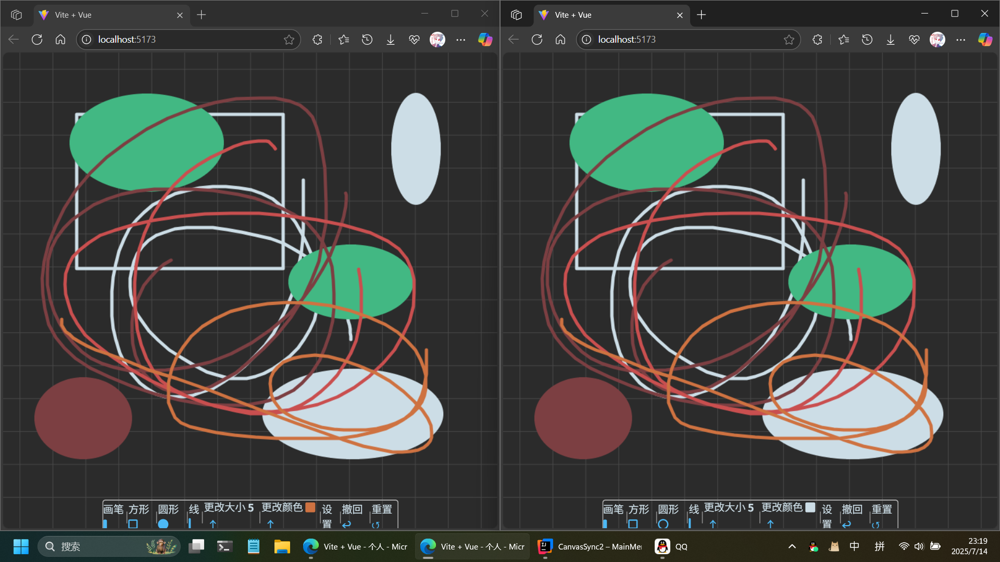

# 同步画布

让两台连接网络的计算机，进行前端**Canvas同步绘制**，多台计算机也会同步

此项目分为前后两端，前端负责渲染，后端只负责消息转发

消息转发的通信流程：

```text
获取频道uuid -> 向频道发送初始信息 -> 实现消息转发
```

> 后端甚至可以脱离此前端直接用来进行消息转发，更多请看MessageForwarding文件夹中的Markdown

效果图：

